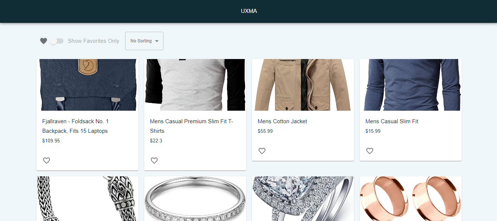

## UXMA (Coding Challenge)

## Screenshot:

## Demo
- You can check the live demo from here  
- <a href="https://grand-stroopwafel-42e178.netlify.app/">https://grand-stroopwafel-42e178.netlify.app/</a> 
 
### Technologies used

- **[React JS](https://react.dev/)**
- **[Redux](https://redux.js.org/)**
- **[Redux-toolkit](https://redux-toolkit.js.org/)**
- **[Typescript](https://www.typescriptlang.org/)**
- **[Jest](https://jestjs.io/)**
- **[React Testing Library](https://testing-library.com/)**
- **[MUI](https://mui.com/)**

# How to run

- Run
  `yarn start`

- Tests
  `yarn test`

- Format
  `yarn format`